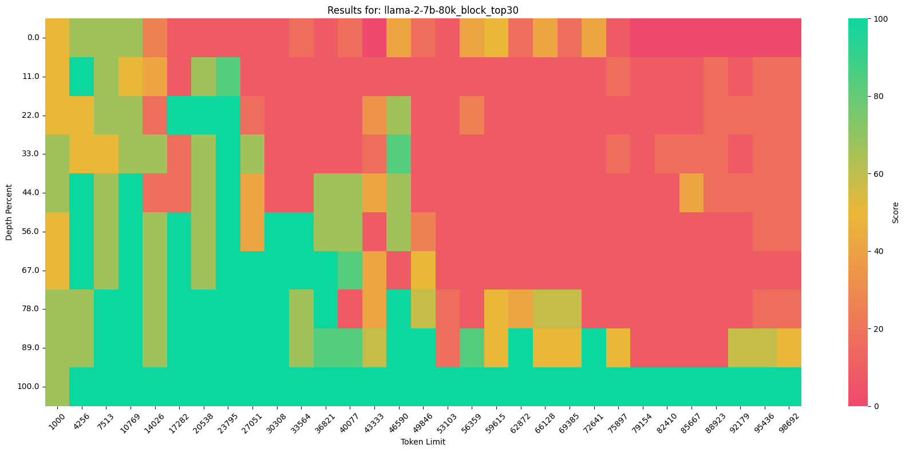
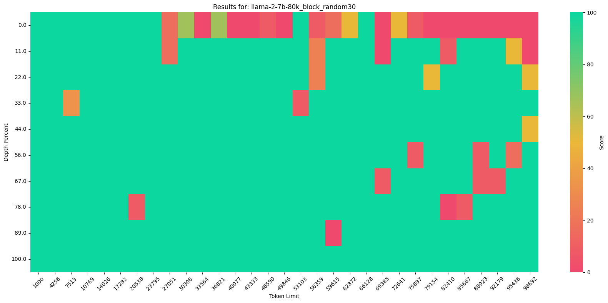

# Retrieval Head
This is the open-source code for paper:
*[Retrieval Head Mechanistically Explains Long-Context Factuality](https://arxiv.org/abs/2404.15574)*. 

This code is implemented based on *[Needle In a HayStack](https://github.com/gkamradt/LLMTest_NeedleInAHaystack/tree/main)*.

【Update】 Support Phi3 now, thanks to the contribution made by @Wangmerlyn.
## Retrieval Head Detection
An algorithm that statistically calculate the retrieval score of attention heads in a transformer model.
Because FlashAttention can not return attention matrix, this algorithm is implemented by first caching with FlashAttention and apply normal attention for decoding. 
### Environment
**Core**: pytorch=2.0.1, transformers=4.37.2, flash-attn=2.5.6 (my environment)

**Other**: rouge_score

A Single 80G GPU is enough to detect up to 50K length.
### Usage :
```python
python retrieval_head_detection.py  --model_path $path_to_model --s 0 --e 50000
```
We find that only few samples can stablely detect some of the strongest retrieval heads. I if you are in a hurry or no fancy large GPUs avalible, you can just set  '--e' to a lower value, e.g.
```python
python retrieval_head_detection.py  --model_path $path_to_model --s 0 --e 5000
```
Results of retrieval score will be write in './head_score/$model_name.json'
**Currently Implemented Model Families**: 
LLama([Llama-2-7B-80K](https://huggingface.co/yaofu/llama-2-7b-80k)), Yi, Qwen, Mistrial

### Results:
All detection results are saved in "./head_score/*.json", where each head is saved in the format of 
```python
{layer-head_id: [list of retrieval scores across detections]}
```
**Directly load a results for Analysis**
```python
## load head score file, llama-2-7b-80k for example
import json
import numpy as np
with open('./head_score/llama-2-7b-80k.json') as file:
    head_list = json.loads(file.readline())
## use the average retrieval score and ranking
head_score_list = [([int(ll) for ll in l[0].split("-")],np.mean(l[1])) for l in head_list.items()]
head_score_list = sorted(head_score_list, key=lambda x: x[1], reverse=True) 
top_retrieval_heads = [[l[0],  round(np.mean(l[1]), 2)] for l in head_score_list][:10]
print(top_retrieval_heads)
'''
Head:[16, 19],   Retrieval Score: 0.94      Head:[11, 15],   Retrieval Score: 0.92      
Head:[8, 26],    Retrieval Score: 0.8       Head:[6, 9],     Retrieval Score: 0.62        
Head:[7, 12],    Retrieval Score: 0.61      Head:[17, 22],   Retrieval Score: 0.56
Head:[11, 2],    Retrieval Score: 0.46      Head:[6, 16],    Retrieval Score: 0.44
Head:[19, 15],   Retrieval Score: 0.42      Head:[21, 30],   Retrieval Score: 0.4
'''
```
## Influence on Needle-in-a-Haystack
This code is implemented by masking the given head in the attention matrix or masking the query in FalshAttention.
### Usage:
Setting --mask_top to K > 0 to mask out top K retrieval heads, K < 0 to mask out K random heads, K = 0 for no masking.

A Single 80G GPU can test up to ~70K length, 2*80G GPU can test up to 100K length

Masking top 30 retrieval heads vs 30 random heads:
```python
python needle_in_haystack_with_mask.py --mask_top 30 --s 1000 --e 100000  --model_path $path_to_model  #Results of  will be written in './results/graph/llama-2-7b-80k_block_top30'
python needle_in_haystack_with_mask.py --mask_top -30 --s 1000 --e 100000  --model_path $path_to_model  #Results of  will be written in './results/graph/llama-2-7b-80k_block_random30'
```
### Reulsts and Visualization:
Replace 'model_name' in './viz/CreateVizFromLLMTesting.ipynb' by the folder name of Needle-in-a-Haystack results.

**Mask top 30 Retrieval Head for Llama-2-7b-80K**:

**Mask random 30 non-Retrieval Head for Llama-2-7b-80K**:

